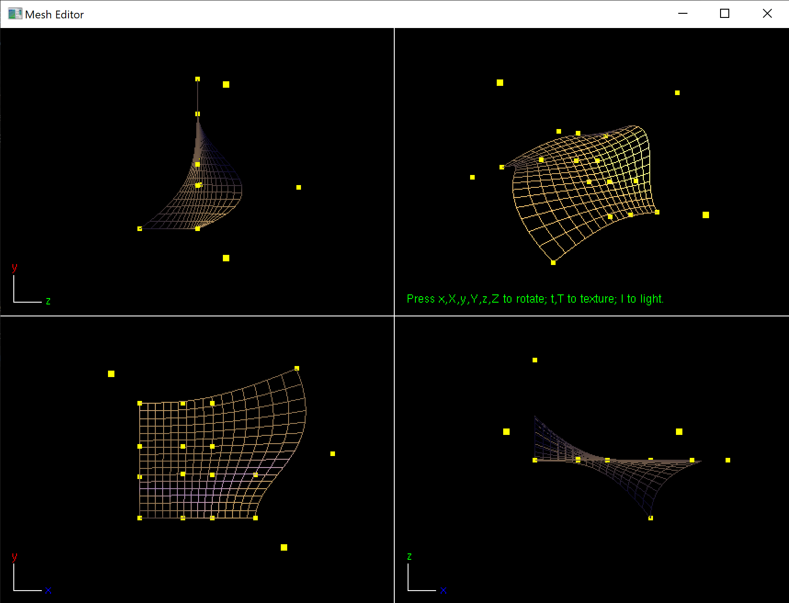


# azulejo-gl-3dmodeler



## Disclaimer

⚠️ **Notice:** This is package is not yet using Modern C++. 
⚠️ **Notice:** This codebase is not fully integrated with [azulejo-common-lib](https://github.com/miclomba/azulejo-common-lib). 

Please be patient while we refactor this codebase.

## Prerequisites

Checkout [azulejo-common-lib](https://github.com/miclomba/azulejo-common-lib) adjacent to this package.

## Install Dependencies

Install [vcpkg](https://github.com/microsoft/vcpkg). Then run:

```
cd azulejo-gl-3dmodeler
vcpkg install --x-manifest-root=. --feature-flags=manifests
```

## Build

0. Start Visual Studio
1. Click `continue without code`
2. Set configuration to be `x64-Debug`
3. `File > Open > CMake`
4. If the 'out' directory is not created automatically (Cmake configuration step) then run: `Project > Configure Cache`
5. `Build > Build All`
6. `Build > Install GL3DModeler`

## Run

0. `Select the Startup Item` to be `GL3DModeler.exe`
1. `Debug > Start Debugging`
